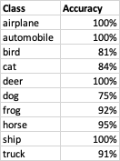
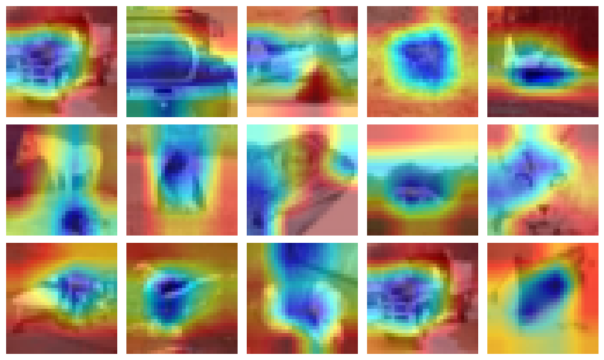
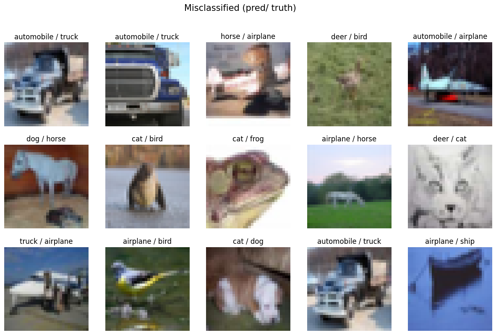
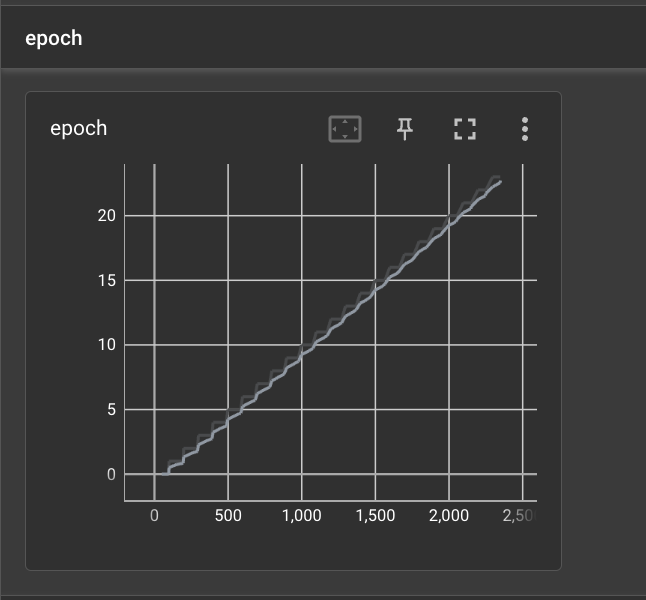
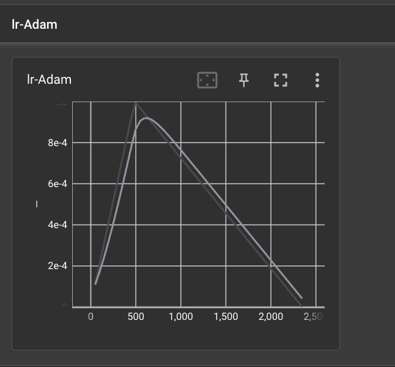

#### Objective: 
Move the Session-10 Assignment to Lightning and Spaces

- Retrain the model on lightning
- Gradio
- Deploy the model in HuggingFace Spaces

#### Results:

- The app can be viewed in [HuggingFace Spaces](https://huggingface.co/spaces/bala1802/ERA_Session12)
    * Input from the user, with respect to see GradCAM images, count, from which layer, including the opactiy
    * Input from the user, whether to view misclassified images, and how many
    * Input from the user, to upload new images (upto 10 images)
- The PyTorch code is moved to [Lightning Module](https://github.com/bala1802/lightning_module)
- Session-12 Python [Notebook](https://github.com/bala1802/ERA-Session-12/blob/main/Session12.ipynb)

#### Observations:

Accuracy of Images predicted:

GradCAM results:

Misclassified Images:

#### Epoch details:

#### Learning Rate:

#### Epoch & Loss Logs;

Epoch 0/23 ━━━━━━━━━━━━━━━━━━━━━━━━━━━━━━━━━━ 98/98 0:00:25 • 0:00:00 3.87it/s v_num: 0 train/loss: 1.681          
                                                                               train/acc: 0.387                    
Epoch 1/23 ━━━━━━━━━━━━━━━━━━━━━━━━━━━━━━━━━━ 98/98 0:00:27 • 0:00:00 3.69it/s v_num: 0 train/loss: 1.216          
                                                                               train/acc: 0.542 val/loss: 1.473    
                                                                               val/acc: 0.477                      
Epoch 2/23 ━━━━━━━━━━━━━━━━━━━━━━━━━━━━━━━━━━ 98/98 0:00:25 • 0:00:00 3.90it/s v_num: 0 train/loss: 0.931          
                                                                               train/acc: 0.679 val/loss: 1.072    
                                                                               val/acc: 0.618                      
Epoch 3/23 ━━━━━━━━━━━━━━━━━━━━━━━━━━━━━━━━━━ 98/98 0:00:27 • 0:00:00 3.61it/s v_num: 0 train/loss: 0.863          
                                                                               train/acc: 0.67 val/loss: 0.856     
                                                                               val/acc: 0.701                      
Epoch 4/23 ━━━━━━━━━━━━━━━━━━━━━━━━━━━━━━━━━━ 98/98 0:00:25 • 0:00:00 3.94it/s v_num: 0 train/loss: 0.727          
                                                                               train/acc: 0.738 val/loss: 0.718    
                                                                               val/acc: 0.748                      
Epoch 5/23 ━━━━━━━━━━━━━━━━━━━━━━━━━━━━━━━━━━ 98/98 0:00:27 • 0:00:00 3.72it/s v_num: 0 train/loss: 0.581          
                                                                               train/acc: 0.789 val/loss: 0.67     
                                                                               val/acc: 0.772                      
Epoch 6/23 ━━━━━━━━━━━━━━━━━━━━━━━━━━━━━━━━━━ 98/98 0:00:26 • 0:00:00 3.80it/s v_num: 0 train/loss: 0.609          
                                                                               train/acc: 0.801 val/loss: 0.722    
                                                                               val/acc: 0.756                      
Epoch 7/23 ━━━━━━━━━━━━━━━━━━━━━━━━━━━━━━━━━━ 98/98 0:00:27 • 0:00:00 3.67it/s v_num: 0 train/loss: 0.562          
                                                                               train/acc: 0.81 val/loss: 0.581     
                                                                               val/acc: 0.805                      
Epoch 8/23 ━━━━━━━━━━━━━━━━━━━━━━━━━━━━━━━━━━ 98/98 0:00:25 • 0:00:00 3.95it/s v_num: 0 train/loss: 0.476          
                                                                               train/acc: 0.839 val/loss: 0.426    
                                                                               val/acc: 0.854                      
Epoch 9/23 ━━━━━━━━━━━━━━━━━━━━━━━━━━━━━━━━━━ 98/98 0:00:27 • 0:00:00 3.69it/s v_num: 0 train/loss: 0.457          
                                                                               train/acc: 0.824 val/loss: 0.427    
                                                                               val/acc: 0.853                      
Epoch 10/23 ━━━━━━━━━━━━━━━━━━━━━━━━━━━━━━━━━━ 98/98 0:00:25 • 0:00:00 3.95it/s v_num: 0 train/loss: 0.455         
                                                                                train/acc: 0.83 val/loss: 0.433    
                                                                                val/acc: 0.854                     
Epoch 11/23 ━━━━━━━━━━━━━━━━━━━━━━━━━━━━━━━━━━ 98/98 0:00:26 • 0:00:00 3.74it/s v_num: 0 train/loss: 0.472         
                                                                                train/acc: 0.845 val/loss: 0.388   
                                                                                val/acc: 0.868                     
Epoch 12/23 ━━━━━━━━━━━━━━━━━━━━━━━━━━━━━━━━━━ 98/98 0:00:25 • 0:00:00 3.91it/s v_num: 0 train/loss: 0.367         
                                                                                train/acc: 0.875 val/loss: 0.341   
                                                                                val/acc: 0.885                     
Epoch 13/23 ━━━━━━━━━━━━━━━━━━━━━━━━━━━━━━━━━━ 98/98 0:00:27 • 0:00:00 3.70it/s v_num: 0 train/loss: 0.401         
                                                                                train/acc: 0.848 val/loss: 0.352   
                                                                                val/acc: 0.881                     
Epoch 14/23 ━━━━━━━━━━━━━━━━━━━━━━━━━━━━━━━━━━ 98/98 0:00:27 • 0:00:00 3.61it/s v_num: 0 train/loss: 0.415         
                                                                                train/acc: 0.86 val/loss: 0.334    
                                                                                val/acc: 0.887                     
Epoch 15/23 ━━━━━━━━━━━━━━━━━━━━━━━━━━━━━━━━━━ 98/98 0:00:26 • 0:00:00 3.84it/s v_num: 0 train/loss: 0.316         
                                                                                train/acc: 0.899 val/loss: 0.331   
                                                                                val/acc: 0.888                     
Epoch 16/23 ━━━━━━━━━━━━━━━━━━━━━━━━━━━━━━━━━━ 98/98 0:00:25 • 0:00:00 3.90it/s v_num: 0 train/loss: 0.332         
                                                                                train/acc: 0.89 val/loss: 0.298    
                                                                                val/acc: 0.9                       
Epoch 17/23 ━━━━━━━━━━━━━━━━━━━━━━━━━━━━━━━━━━ 98/98 0:00:26 • 0:00:00 3.86it/s v_num: 0 train/loss: 0.317         
                                                                                train/acc: 0.884 val/loss: 0.319   
                                                                                val/acc: 0.896                     
Epoch 18/23 ━━━━━━━━━━━━━━━━━━━━━━━━━━━━━━━━━━ 98/98 0:00:25 • 0:00:00 3.85it/s v_num: 0 train/loss: 0.288         
                                                                                train/acc: 0.899 val/loss: 0.296   
                                                                                val/acc: 0.905                     
Epoch 19/23 ━━━━━━━━━━━━━━━━━━━━━━━━━━━━━━━━━━ 98/98 0:00:25 • 0:00:00 3.87it/s v_num: 0 train/loss: 0.289         
                                                                                train/acc: 0.899 val/loss: 0.284   
                                                                                val/acc: 0.904                     
Epoch 20/23 ━━━━━━━━━━━━━━━━━━━━━━━━━━━━━━━━━━ 98/98 0:00:25 • 0:00:00 3.91it/s v_num: 0 train/loss: 0.205         
                                                                                train/acc: 0.926 val/loss: 0.263   
                                                                                val/acc: 0.913                     
Epoch 21/23 ━━━━━━━━━━━━━━━━━━━━━━━━━━━━━━━━━━ 98/98 0:00:25 • 0:00:00 3.88it/s v_num: 0 train/loss: 0.227         
                                                                                train/acc: 0.908 val/loss: 0.262   
                                                                                val/acc: 0.913                     
Epoch 22/23 ━━━━━━━━━━━━━━━━━━━━━━━━━━━━━━━━━━ 98/98 0:00:28 • 0:00:00 3.50it/s v_num: 0 train/loss: 0.245         
                                                                                train/acc: 0.905 val/loss: 0.249   
                                                                                val/acc: 0.917                     
Epoch 23/23 ━━━━━━━━━━━━━━━━━━━━━━━━━━━━━━━━━━ 98/98 0:00:27 • 0:00:00 3.70it/s v_num: 0 train/loss: 0.195         
                                                                                train/acc: 0.932 val/loss: 0.244   
                                                                                val/acc: 0.918     
